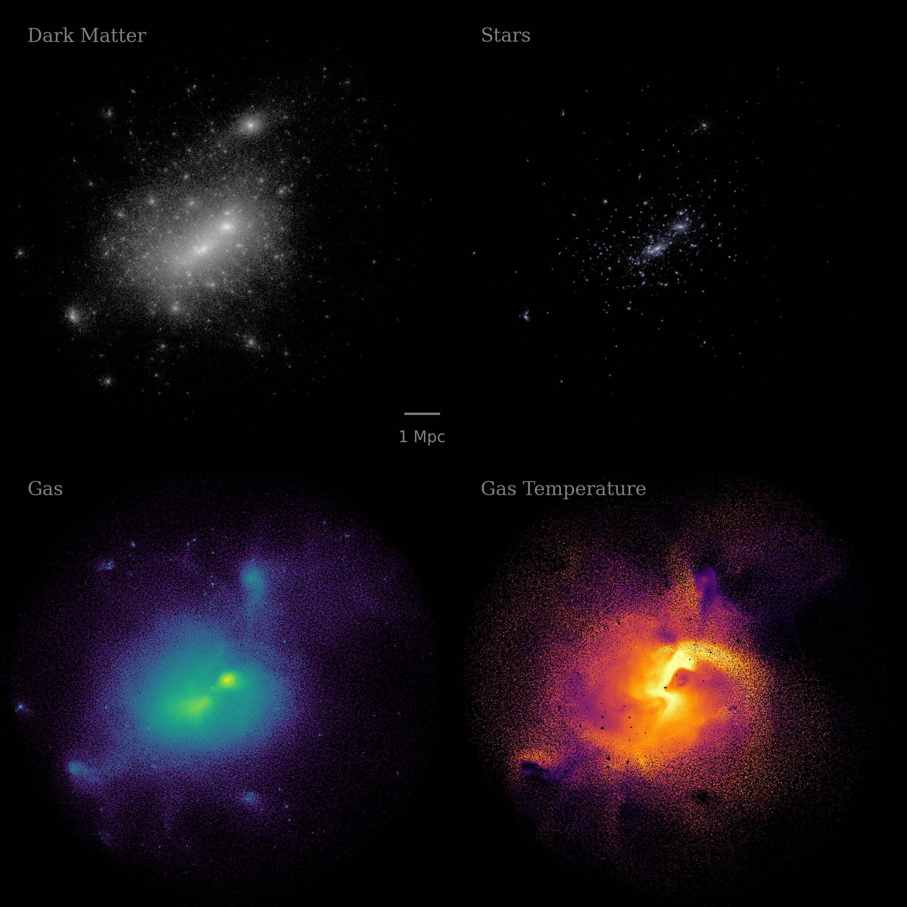
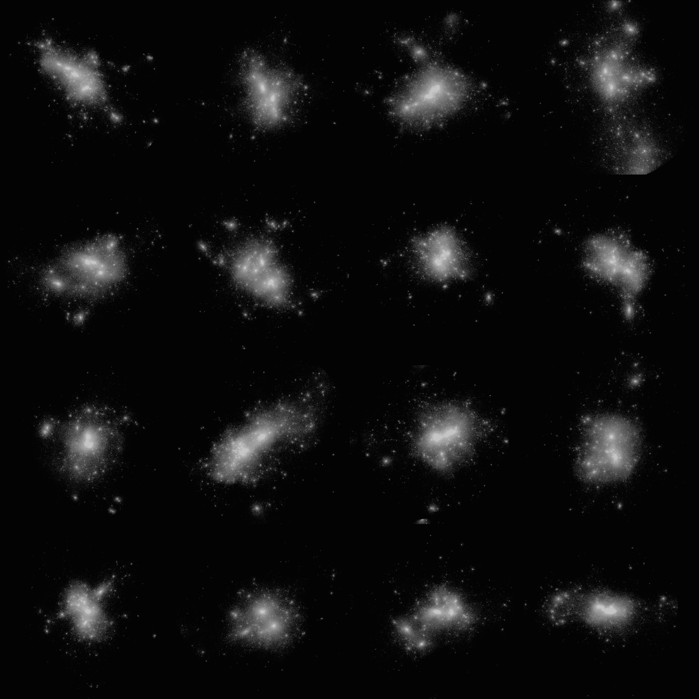
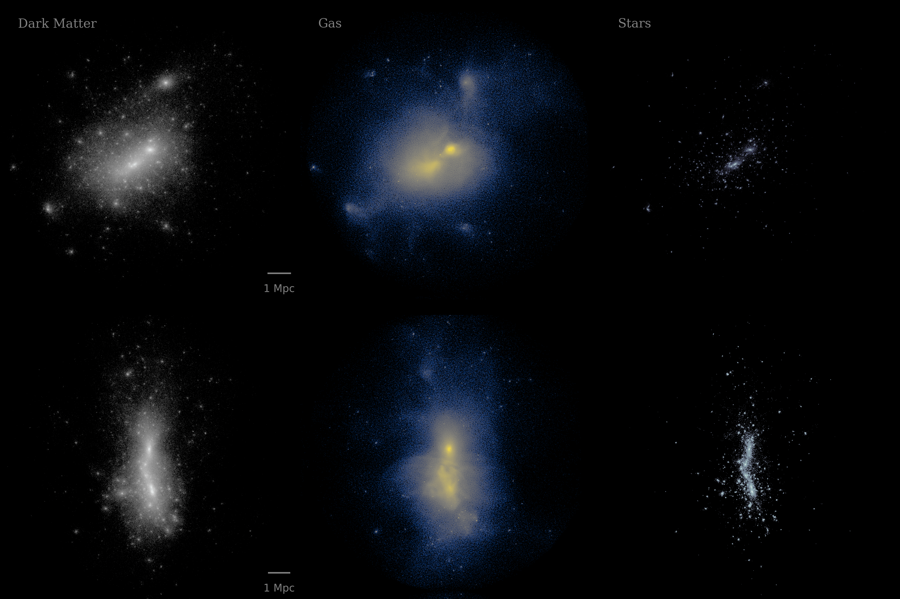

Analyzing Particle Data with yt
===============================

**Note: The dependencies for the yt analysis tools are not installed by default. You can install them with** ``opencosmo install haloviz``.

`yt <https://github.com/yt-project/yt>`_ is an open-source Python package for analyzing and visualizing volumetric simulation data. Although yt was originally designed with AMR (Adaptive Mesh Refinement) codes in mind, support for SPH (Smoothed Particle Hydrodynamics) data is continually improving. As of yt version 4.4, most core functionality works reliably with SPH data, though some features may still require workarounds. In many cases, this involves depositing particle data onto a mesh using a ``YTArbitraryGrid`` object before passing it to specific yt functions.

In OpenCosmo, you can load particle datasets into yt using :func:`opencosmo.analysis.create_yt_dataset`. 
This is effectly doing the same as `yt.load`, however, we have opted to use the OpenCosmo toolkit
to handle the initial data selection.

Here is an example for how to use `create_yt_dataset` to load a selection of data into yt and make a simple projection

.. code-block:: python

    from opencosmo.analysis import create_yt_dataset, ParticleProjectionPlot

    # select a random halo
    with oc.open("haloproperties.hdf5", "haloparticles.hdf5").take(1, at="random") as data:
        # get yt data container
        yt_ds = create_yt_dataset(next(data.halos()))

        # list all fields
        print(yt_ds.derived_field_list)

        # project DM particle mass
        ParticleProjectionPlot(yt_ds, "z", ("dm", "particle_mass")).save()
    

For convenience, OpenCosmo includes wrappers for several commonly used yt plotting functions, including:

- :func:`opencosmo.analysis.ParticleProjectionPlot` (wraps ``yt.ParticleProjectionPlot``)
- :func:`opencosmo.analysis.ProjectionPlot` (wraps ``yt.ProjectionPlot``)
- :func:`opencosmo.analysis.SlicePlot` (wraps ``yt.SlicePlot``)
- :func:`opencosmo.analysis.ProfilePlot` (wraps ``yt.ProfilePlot``)
- :func:`opencosmo.analysis.PhasePlot` (wraps ``yt.PhasePlot``)

These wrappers follow the same naming conventions as the original yt functions and have been verified to work out-of-the-box with HACC SPH data.

For an overview of yt’s broader functionality, refer to the official `yt documentation <https://yt-project.org/doc/index.html>`_.

For introductory tutorials, see:

- `Making Simple Plots <https://yt-project.org/doc/cookbook/simple_plots.html>`_
- `A Few Complex Plots <https://yt-project.org/doc/cookbook/complex_plots.html>`_

Simulating X-ray Emission with pyXSIM
=====================================

To include synthetic X-ray emissivity and luminosity fields from gas particles in your yt dataset, you can enable the ``compute_xray_fields`` flag when calling :func:`opencosmo.analysis.create_yt_dataset`. This integrates with `pyXSIM <https://hea-www.cfa.harvard.edu/~jzuhone/pyxsim/>`_, a toolkit for generating synthetic X-ray observations from simulation data.

When ``compute_xray_fields=True``, the function internally creates a :class:`pyxsim.CIESourceModel` using the particle data and attaches the following derived fields to the `yt` dataset:

- X-ray emissivity per particle
- X-ray luminosity in a user-specified energy band
- Any additional fields required for photon sampling (e.g., emission measure)

You can also pass model-specific configurations via the ``source_model_kwargs`` argument, which is forwarded directly to the :class:`pyxsim.CIESourceModel` constructor. Common options include:

- ``emin`` (float): Minimum photon energy in keV (default: 0.1)
- ``emax`` (float): Maximum photon energy in keV (default: 10.0)
- ``nbins`` (int): Number of bins across the energy band (default: 1000)
- ``model`` (str): which emission model to use (default: "apec")

For the full list of options, see `CIESourceModel <https://hea-www.cfa.harvard.edu/~jzuhone/pyxsim/api/source_models.html#pyxsim.source_models.thermal_sources.CIESourceModel>`_.

If ``return_source_model=True``, the function will return a 2-tuple ``(ds, source_model)``, where ``source_model`` is the ``CIESourceModel`` instance. This allows further customization or photon generation using pyXSIM directly.

We will now edit the code-block from before to compute X-ray luminosities:

.. code-block:: python

    from opencosmo.analysis import create_yt_dataset, ParticleProjectionPlot

    # set source model parameters
    source_model_kwargs = {
        "emin": 0.1, # keV
        "emax": 10.0 # keV
    }

    # select a random halo
    with oc.open("haloproperties.hdf5", "haloparticles.hdf5").take(1, at="random") as data:
        # get yt data container
        ds_yt, source_model = create_yt_dataset(next(data.halos()), 
            compute_xray_fields = True, return_source_model = True)

        # list all fields
        print(ds_yt.derived_field_list)

        # project X-ray luminosity in the specified band
        ParticleProjectionPlot(ds_yt, "z", ("gas", "xray_luminosity_0.1_10.0_keV")).save()

Visualizing Halos
=================

In addition to individual yt plots, OpenCosmo provides utilities for visualizing multiple halo projections at once.

The two primary functions for this purpose are:

- :func:`opencosmo.analysis.visualize_halo` — a simple 2x2 panel plot for one halo
- :func:`opencosmo.analysis.halo_projection_array` — a customizable grid of halos and fields

These use yt under the hood, and are useful for visually inspecting halos with minimal input required.

Quick Projections
-----------------

The :func:`visualize_halo` function takes in a single halo ID and creates a multi-panel image showing particle projections of dark matter, stars, gas, and/or gas temperature for a the halo. If ``"dm"/"gravity"``, ``"star"``, and ``"gas"`` particles are all present, this will output a 2x2-panel figure. Otherwise, this will create a 1xN-panel figure showing whichever particles/fields from the list are present.
This function essentially uses :func:`halo_projection_array` with pre-filled settings for fields, colormaps, and labels. Settings are tuned to look good for halos with :math:`M_\mathrm{200c} > 10^{14}\ M_\odot`.

.. code-block:: python

    from opencosmo.analysis import visualize_halo
    import opencosmo as oc
    import matplotlib.pyplot as plt

    # load one halo at random
    with oc.open("haloproperties.hdf5", "haloparticles.hdf5").take(1, at="random") as data:
        halo = next(data.halos())
        halo_id = halo["halo_properties"]["unique_tag"]

        fig = visualize_halo(halo_id, data)

    # save the image
    fig.savefig("halo_2x2_example.png")

A More Customizable Option
--------------------------

The :func:`halo_projection_array` function allows fine-grained control over what gets visualized, including:

- Plotting different halos and/or fields per panel
- Weighting projections by other quantities
- Using different colormaps and colorbar limits
- Customizing panel labels and layout

For the full list of customization options, see :func:`opencosmo.analysis.halo_projection_array`

Multiple Halos, Single Field
~~~~~~~~~~~~~~~~~~~~~~~~~~~~

At minimum, :func:`halo_projection_array` takes in a 2D array of halo IDs and the ``StructuredCollection`` dataset containing the relevant halos. 
The outputted figure is an array of images, with the shape matching that of the halo ID array. For example:

.. code-block:: python

    from opencosmo.analysis import halo_projection_array
    import opencosmo as oc
    import matplotlib.pyplot as plt
    import numpy as np

    # load 16 halos at random
    with oc.open("haloproperties.hdf5", "haloparticles.hdf5").take(16, at="random") as data:
 
        halo_ids = [halo['halo_properties']['unique_tag'] for halo in data.halos()]

        # construct 4x4 array of halo ids and make a 4x4 array of dark matter projections
        fig = halo_projection_array(np.reshape(halo_ids,(4,4)), data, 
                    field=("dm","particle_mass"), width=6.0)

    # save the image
    fig.savefig("halo_4x4_example.png")

Multiple Halos, Multiple Fields
~~~~~~~~~~~~~~~~~~~~~~~~~~~~~~~

One can also define a dictionary of plotting parameters to plot different fields and/or halos in each panel:

.. code-block:: python

    from opencosmo.analysis import halo_projection_array
    import opencosmo as oc
    import matplotlib.pyplot as plt
    import numpy as np

    with oc.open("haloproperties.hdf5", "haloparticles.hdf5").take(2, at="random") as data:
        halo_ids = [halo["halo_properties"]["unique_tag"] for halo in data.halos()]

        # We are going to make a 2x3 panel figure, where each row is a different halo, and
        # each column is a different projected quantity
        halo_ids = (
            [halo_ids[0], halo_ids[0], halo_ids[0]],
            [halo_ids[1], halo_ids[1], halo_ids[1]]
        )

        # construct dictionary of plotting parameters.
        # Each item should be a 2x3 array
        params = {
            "fields": (
                [("dm", "particle_mass"), ("gas", "particle_mass"), ("star","particle_mass")],
                [("dm", "particle_mass"), ("gas", "particle_mass"), ("star","particle_mass")]
            ),
            "labels": (
                ["Dark Matter", "Gas", "Stars"],
                [None, None, None]
            ),
            "cmaps": (
                ["gray", "cividis", "bone"],
                ["gray", "cividis", "bone"]
            ),
        }

        # Make 2x3 array of halo projections with length scales displayed on the leftmost column
        fig = halo_projection_array(halo_ids, data, 
                    params=params, length_scale="all left")

    # save the image
    fig.savefig("halo_2x3_example.png")

